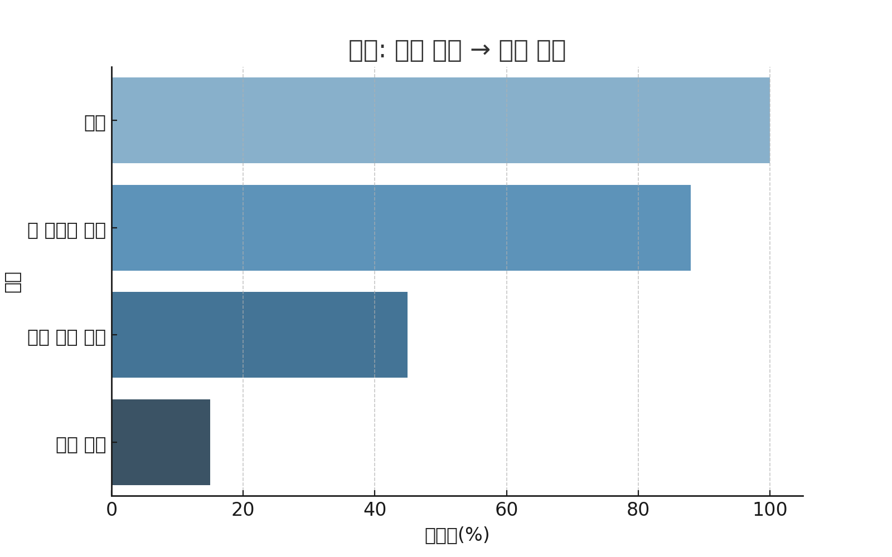

# 구독형 플랫폼 로그 분석 기반 리텐션 및 유료 전환 전략 수립

### 분석 카테고리: 프로덕트 분석
> **분석 기간** &nbsp;|&nbsp;  2025.07.18 ~ 2025.07.27
> **분석 유형** &nbsp;|&nbsp;  개인 프로젝트  
> **분석 기법** &nbsp;|&nbsp;  Cohort 분석, Funnel 분석, 북극성 지표 기반 KPI 설계, A/B 테스트 시뮬레이션  
> **분석 기술** &nbsp;|&nbsp;   

---

## 0. 프로젝트 구성 안내

### 디렉토리 구조

```plaintext
📁 subscription-retention-analysis/
 ┣ 📁 code/              분석 코드 (Python, BigQuery SQL)
 ┣ 📁 images/            분석 시각화 결과
 ┣ 📁 reports/           요약 보고서 및 발표자료 (PDF)
 ┣ 📄 ab_test_plan.pdf   A/B 테스트 설계안
 ┣ 📄 README.md          프로젝트 설명 문서
 ┗ 📄 requirements.txt   사용한 Python 패키지 목록
```
---

## 1. 프로젝트 개요

### 📌 세 줄 요약
- 구독형 플랫폼의 **무료 체험 사용자 행동 분석** 및 **14일 유료 전환 최적화 전략** 수립  
- Cohort Retention Curve, Funnel 분석, 가설 검정 및 **북극성 지표(NSM)** 설계  
- 개인화 푸시알림, 콘텐츠 추천 및 A/B 테스트 설계로 **유료 전환율 +7%p 개선 기대**

---

## 2. 문제 정의 및 접근 방식

### Situation
- 구독형 서비스의 **14일 무료 체험 종료 후 유료 전환율이 15%로 매우 낮음**
- 유료 전환 실패 시 고객 이탈로 이어져 **서비스 지속가능성 저하**

### Task
- 무료 체험 Cohort 분석 및 유료 전환 구간 이탈 원인 탐색
- 세그먼트별 행동 패턴 분석 및 개선 전략 수립

### Action
- **BigQuery SQL**: 대용량 로그 데이터 분석
- **Python(Pandas)**: 데이터 전처리 및 시각화
- **Tableau**: Funnel 전환율 및 Cohort Retention Dashboard 제작
- **A/B 테스트 설계**: 전략 효과 시뮬레이션

### Result
- **무료 체험 → 유료 전환율 +7%p 상승 기대**
- 전략별 전환율 향상 효과 시뮬레이션 완료

---

## 3. 프로젝트 진행

### 3-1) Cohort Retention 분석
- 가입 Cohort별 **Day N Retention Curve** 도출
- 무료 체험 Cohort vs 유료 전환 Cohort 비교
- 

---

### 3-2) Funnel 분석 및 유료 전환율 도출
- Funnel: **가입 → 첫 콘텐츠 소비 → 무료 체험 완료 → 유료 전환**
- 유료 전환 구간에서 **최대 이탈률(85%)** 확인
- 

| 단계                          | 전환율 (%) |
|--------------------------------|------------|
| 가입 → 첫 콘텐츠 소비          | 88%        |
| 콘텐츠 소비 → 무료 체험 완료    | 45%        |
| 무료 체험 완료 → 유료 전환     | **15%**    |

---

### 3-3) 가설 검정 및 세그먼트 분석
- 

| 가설코드 | 가설 내용                                               | 결과                |
|----------|----------------------------------------------------------|---------------------|
| H1       | 주말 가입자는 평일 가입자보다 유료 전환율이 낮다         | ✅ 유의미 (p<0.05)   |
| H2       | 푸시알림 수신자가 미수신자보다 전환율이 높다             | ✅ 유의미 (p<0.01)   |
| H3       | 무료 체험 중 콘텐츠 소비량 상위 20% 전환율이 높다         | ✅ 유의미 (p<0.001)  |

---

### 3-4) A/B 테스트 설계
- **실험군**: 개인화 콘텐츠 추천 및 푸시알림 전송 그룹
- **대조군**: 기존 무료 체험 그룹
- **KPI**: 유료 전환율, 체험 기간 중 콘텐츠 소비량, 푸시알림 반응률

---

## 4. 프로젝트 결과 및 기대 효과

### 전략 요약
1. **콘텐츠 소비 촉진**: 무료 체험 초반 집중 콘텐츠 추천
2. **개인화 푸시알림**: 체험 종료 5일 전 유료 전환 유도
3. **A/B 테스트 설계**: 전략 효과 검증

---

### 예상 효과

| 전략                       | 전환율 개선 기대치 |
|----------------------------|---------------------|
| 개인화 콘텐츠 추천         | +5%p                |
| 푸시알림 및 리마인더       | +2%p                |
| **합계**                    | **+7%p (22% 달성)**|

---

## 4. 프로젝트 회고
### ✏️ Learned Lessons
- 무료 체험 사용자 분석을 통한 **전환 전략 설계 경험**
- 대용량 로그 데이터 처리 및 지표 설계 역량 강화
- **북극성 지표(NSM)** 중심 데이터 분석의 중요성 체득
